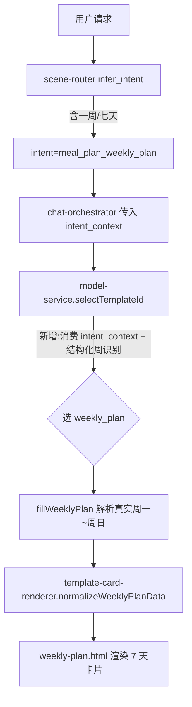

## 用户诉求

用户要求生成"一周（周一~周日 7 天）膳食计划"，但系统始终只返回单日（diet_card）卡片，没有一周数据。用户贴出了期望的周结构数据（🗓️周一/周二/周三… 各含早/午/晚 餐与热量），并强调"还是没有一周的数据"。

## 核心功能

- 主请求路径：当用户请求一周/周计划，或给出"周一…周日"结构化膳食数据时，应生成 7 天 `weekly_plan` 卡片（而非单日 `diet_card`）。
- 真实数据优先：一周计划的 7 天餐食应来自用户消息或业务表真实数据，缺失时才回退示例，不再输出与用户无关的写死占位。
- 预览一致：admin 模板工作台预览 `weekly_plan` 时，样例数据需为合法 7 天对象数组，能看到真实一周内容。

## 现状根因（已深入研究确认）

1. 意图被识别却丢弃：`meal-plan.js` 的 `infer_intent` 在含"一周/七天/周计划"时返回 `meal_plan_weekly_plan`，`chat-orchestrator.js:42-51` 也把 `intent_context` 传入了 `fillTemplateSlots`；但 `model-service.js` 的 `selectTemplateId` 只扫 `message` 字面词，从不读 `intent_context.intent`，用户粘贴"周一…周二…周三"却没写"一周"二字时必然回退 `diet_card`。
2. mock 填充忽略真实数据：`fillWeeklyPlan` 仅把 `business_data.items` 当"偏好"前缀，7 天全写死占位。
3. 预览样例 JSON 损坏：`weekly_plan.sample.json:6` 的 `weekly_plan.items` 是字符串，渲染层 `normalizeWeeklyItems` 收到字符串后回退 7 条默认占位，预览看不到真实数据。

## 技术栈

- Node.js（ESM），既有 `template-card` 渲染管线与 `template-card-renderer`、`model-service` mock 链路，无新增框架。
- 当前 `FLATTALK_MODEL_MODE=admin` 且无模型密钥，实际走 `template-card-llm-service.js` 的 `fallback → fillTemplateSlotsMock`，故 mock 路径修复直接影响用户所见。

## 实现思路（高层）

在数据流"意图识别 → 模板选择 → mock 填充 → 渲染"中打通 weekly 意图并消费真实数据，复用既有 `normalizeWeeklyItems`/`normalizeWeeklyPlanData` 的 7 天数组约定，不新增架构。

### 关键决策与权衡

1. **模板选择消费意图**：在 `model-service.js` 的 `selectTemplateId` 中读取 `input.intent_context?.intent === 'meal_plan_weekly_plan'` 强制 `weekly_plan`，并扩展周计划识别正则覆盖"周一到周日 / 7天 / 七天"等结构化表述。权衡：不改 scene-router，仅在最接近消费的 mock 入口补一层意图消费，影响面最小、向后兼容（`requested_template_id` 仍优先）。
2. **结构化周数据解析**：新增 `parseWeekFromText(message, businessData)`，按 `🗓️周一 / 周二 / 周三 / 周X` 分段，每段再按 `🌅早餐 / ☀️午餐 / 🌙晚餐` 或"早餐/午餐/晚餐"切出菜品与热量；解析出 N 天则补足 7 天（不足用示例兜底）。权衡：用轻量正则而非依赖 LLM，保证无模型时也能从粘贴文本产出真实一周数据。
3. **`fillWeeklyPlan` 重写**：优先用 `parseWeekFromText` 的真实结果；仅当全空时回退既有 7 天示例，避免"套话"。
4. **样例 JSON 修复 + 渲染校验**：把 `weekly_plan.sample.json` 改为与 `weekly-plan.html` 内嵌 `<script id="sample">` 一致的 7 天对象数组；在 `template-card-renderer.js` 的 `normalizeWeeklyPlanData` 增加"items 必须为数组且长度 7、meals 含早午晚"的兜底与告警，防止再次退化成字符串。

### 性能与可靠性

- `parseWeekFromText` 为纯字符串处理，O(n) 单遍扫描，无外部依赖、无额外 IO，开销可忽略。
- 渲染层校验为同步防御，仅在 `items` 缺字段时回退，不影响主路径性能。
- 日志沿用既有 `createRuntimeLogger`，仅在字段异常时记录 warning，不打印大体积 payload。

## 实现要点（落地注意）

- 保持 `weekly-plan.html` 既有的 `{{weekly_plan.items}}` / `{{#meals}}` 嵌套占位符不变，只修正数据层。
- 不触碰 `diet_card` 默认模板与"生成一周计划"动作链路（该路径已强制 `template_id:'weekly_plan'`，本身正确）。
- 修复后须保证：①主请求"一周"类消息命中 weekly_plan；②粘贴"周一…周日"结构化数据也命中 weekly_plan 且内容来自用户；③admin 预览 weekly_plan 显示真实 7 天。

## 架构与数据流（修复后）



## 目录结构与改动文件

```
src/
├── core/
│   ├── model-service.js                 # [MODIFY] selectTemplateId 消费 intent_context.intent 与结构化周识别；重写 fillWeeklyPlan 解析真实数据；新增 parseWeekFromText
│   └── render/
│       └── template-card-renderer.js    # [MODIFY] normalizeWeeklyPlanData 增加 items 数组/长度7/餐次完整性校验与告警
└── skills/meal_plan/templates/
    └── data/
        └── weekly_plan.sample.json      # [MODIFY] items 由字符串改为 7 天对象数组（与 weekly-plan.html 内嵌 sample 一致）
tests/
└── meal-plan-weekly.test.js            # [NEW] 断言：一周请求→weekly_plan 且渲染 7 天、结构化粘贴数据→命中 weekly_plan 且内容来自用户
scripts/
└── _check-weekly-templates.mjs         # [NEW 临时] 渲染 weekly_plan 校验 7 天齐全/字段齐全/无残留 {{ }}
```

## 关键代码结构（接口级）

```js
// model-service.js 新增/调整
function selectTemplateId({ message, template_id, default_template_id, template_library, intent_context = {} }) {
  if (template_id && template_id !== 'answer') return template_id;
  const ids = (template_library || []).map(t => t.id);
  // 新增：消费意图与结构化周识别
  const isWeekly = intent_context?.intent === 'meal_plan_weekly_plan'
    || isWeeklyPlanText(message) || isStructuredWeekText(message);
  if (ids.includes('weekly_plan') && isWeekly) return 'weekly_plan';
  if (ids.includes('diet_card') && isMealPlanText(`${message} ${(template_library||[]).map(t=>t.match||'').join(' ')}`)) return 'diet_card';
  if (default_template_id && ids.includes(default_template_id)) return default_template_id;
  return ids[0] || default_template_id || 'answer';
}
```

```
// weekly_plan.sample.json 目标结构（节选）
{
  "weekly_plan": {
    "badge": "一周计划", "title": "七天控糖清淡膳食计划",
    "summary": "…", "items": [
      { "dayName": "周一", "dayTotal": "约1250kcal", "summary": "…",
        "meals": [ {"mealName":"早餐","foods":"燕麦小米粥、水煮蛋、凉拌黄瓜","mealCal":"约300kcal"}, … ] },
      …
    ]
  },
  "followup_suggestions": [ {"label":"按慢病调整","user_prompt":"…","action_key":"meal_plan.adjust_for_condition"} ]
}
```