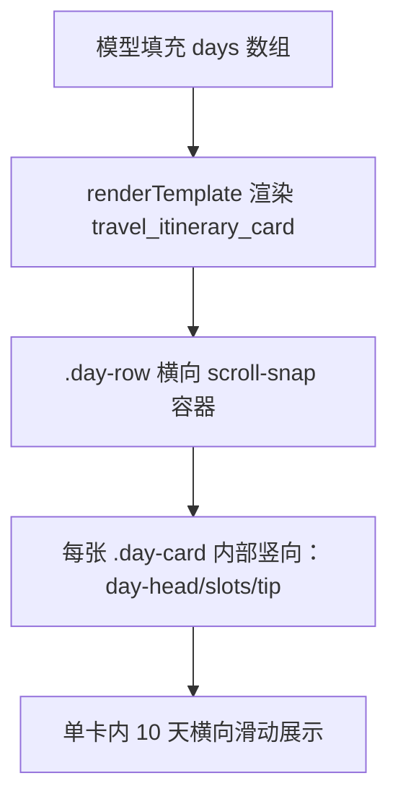

## 用户诉求

用户针对「10天防城港旅居行程」卡片，指出 admin 模板工作台里命名卡片的 tab 是横向排列的，但生成的 itinerary 卡片内部 10 天仍然是竖向堆叠，要求改成「横着走」。用户已明确选择方案 A：保持单张卡片，把内部 days 改成横向滑动一排（scroll-snap，每屏可见 1~2 天）。

## 核心功能

- 单卡内部 days 横向排列：用横向可滚动容器包裹 `{{#days}}` 循环，支持左右滑动（scroll-snap 吸附），每屏展示 1~2 天，不改变单卡形态。
- 既有的竖向信息层级（日徽标 + 主题 + 上午/下午/傍晚时段 + 贴心提示）在每张日卡内保持不变。
- 样例数据扩展为真实 10 天（D1~D10），使 admin 预览即为「10 天横向滑动」效果，匹配用户对「10天横着走」的预期。
- manifest 的 layout 由 vertical 改为 horizontal，与卡片内部横向布局保持一致。

## 技术栈

- 纯 HTML + 内联 CSS 模板（无框架、无 JS），沿用现有 `travel_itinerary_card.html` 的占位符渲染管线（`src/template-card/render.js` 的 mustache 风格 `{{#days}}` 循环），不引入新依赖。
- 运行时无 LLM 依赖：模板布局对任意数量的 `days` 通用，真实数据由模型填充，样例仅用于 admin 预览。

## 实现思路

在数据流「模板渲染（renderTemplate）→ admin 预览 / 聊天返回」中，仅调整 `travel_itinerary_card` 的 CSS 与模板包裹结构，使其内部 days 由竖向堆叠变为横向 scroll-snap 一排。复用现有占位符，不改动字段契约。

### 关键决策与权衡

1. **新增 `.day-row` 横向容器**：在 `.wrap` 内用 `<div class="day-row">` 包裹 `{{#days}}` 循环，`.day-row` 设 `display:flex; flex-direction:row; overflow-x:auto; scroll-snap-type:x mandatory`。权衡：不改 deck 的 horizontal 语义（那是多卡并排），只在单卡内部用普通 flex 横排，影响面最小、向后兼容。
2. **`.day-card` 改为横排子项**：`flex:0 0 82%; max-width:300px; scroll-snap-align:center; margin-bottom:0`，去掉原有的竖向 `margin-bottom`，保留内部竖向布局（day-head / slots / tip）。权衡：固定 82% 宽度保证移动端每屏可见约 1.2 天、桌面端约 2 天，scroll-snap 提供「吸附」手感。
3. **manifest layout 改 horizontal**：让 admin 模板工作台对该模板标记横向，语义与渲染一致；不影响 `{{#days}}` 循环逻辑。
4. **样例扩成 10 天**：把原 4 个区间块（D1-D2 / D3-D5 / D6-D8 / D9-D10）的内容合理拆分到 D1~D10 共 10 个独立日卡，每卡含 `slots`（上午/下午/傍晚）与 `tip`，预览即呈现「10 天横滑」。

### 性能与可靠性

- 纯 CSS 滚动，无 JS、无额外 IO、无重排热点；`overflow-x:auto` 仅在该卡片内创建独立滚动上下文，不触发整页重排。
- 占位符契约不变（`title/intro/days[].day/theme/slots[].time+text/tip/note`），`src/template-card/discover.js` 扫描字段不受影响，`required:["title","days"]` 保持不变。
- 隐藏滚动条样式用 `::-webkit-scrollbar` 轻量美化，不影响功能。

## 实现要点

- 保持 `.day-head / .slot / .day-tip` 等内部结构不变，仅改外层排列。
- 不采用方案 B（每天独立卡进 deck），严格按用户所选 A 实施。
- 修复后用模板渲染链路（或 admin 模板工作台）渲染 `travel_itinerary_card`，确认 days 横向排列、可左右滑动、无残留 `{{ }}`、10 天齐全。

## 架构与数据流（布局改造后）



## 目录结构与改动文件

```
src/skills/travel_route/templates/html/
├── travel_itinerary_card.html       # [MODIFY] 新增 .day-row 横向滚动 CSS；.day-card 改为横排子项；用 .day-row 包裹 {{#days}} 循环；内嵌样例数据扩为 10 天 D1~D10
└── travel_itinerary_card.manifest.json  # [MODIFY] layout 由 vertical 改为 horizontal
```

## 关键代码结构（占位符契约，保持不变）

```
{{title}} / {{intro}}
{{#days}}
  {{day}} {{theme}}
  {{#slots}} {{time}} {{text}} {{/slots}}
  {{#tip}} ... {{/tip}}
{{/days}}
{{note}}
```

## 设计风格

沿用现有 itinerary 卡片的温暖橙系康养风格（主色 #FF7826 渐变、米色背景 #F8EAD9、白卡），仅将内部信息排布由「竖向长列表」重构为「横向滑动日卡带」，保持单卡形态与既有视觉语言一致。

## 页面/卡片结构（单卡内）

- 顶部：标题 `.chat-section-title`（行程安排）+ 简介 `.intro`，保持原有。
- 中部（改造核心）：`.day-row` 横向滚动容器，内含 10 张 `.day-card`。每张日卡保留竖向信息层级——日徽标 `.day-num`（橙渐变胶囊）+ 当日主题 `.day-theme`；下方 `上午/下午/傍晚` 三段 `.slot`（标签 + 内容）；底部绿色贴心提示 `.day-tip`。
- 底部：`.note` 行程可调提示，保持原有。

## 交互与响应式

- `.day-row` 支持触控/鼠标横向滑动，`scroll-snap-type:x mandatory` 让每次滑动吸附到最近日卡，落点稳定。
- 日卡 `flex:0 0 82%; max-width:300px`：移动端（约 360~400px 宽）每屏可见约 1.2 天，桌面端（≤640px 容器）约 2 天，信息密度适中、不局促。
- 滚动条用 `::-webkit-scrollbar` 细化为 6px 橙色半透明圆角，兼顾可见性与美观；`scroll-snap-align:center` 居中吸附。
- 不改变卡片在 chat / admin 中的承载方式，仅内部重排，对外布局契约不变。

## 视觉一致性

- 复用 `:root` 既有 CSS 变量（--primary / --primary-gradient / --bg / --bg-white / --ink / --border 等），不新增颜色，保证与同技能其他卡片（route_card 等）风格统一。